 

  

### _Hi,_ I'm Joonas. 👋

I have been enjoying problem solving and developing, and creating something!

**Socials**

**Technicals**

 

**Thanks**

**Latest Blog Posts**
<!-- feed start -->
- 2022/03/31 - [[딥러닝 일지] MNIST Competition](https://blog.joonas.io/198)
- 2022/03/29 - [[딥러닝 일지] 오프라인에서 파이토치 모델 불러오기](https://blog.joonas.io/197)
- 2022/03/26 - [[딥러닝 일지] Conv2d 알아보기](https://blog.joonas.io/196)
- 2022/03/25 - [[딥러닝 일지] 데이터 늘리기 (Data Augmentation)](https://blog.joonas.io/195)
- 2022/03/24 - [[딥러닝 일지] 이미지 가지고 놀기 (변환하기)](https://blog.joonas.io/193)
<!-- feed end -->

**📊 Metrics**

Click to see

  

