 

  

### [_Hi, I'm Joonas. 👋_](#)

I have been enjoying problem solving and developing, and creating something!

**Socials**

**Technicals**

 

**Projects**

- 🎨 [boj-extended](https://github.com/joonas-yoon/boj-extended) - Styling extension for BOJ
- 🗃️ [json-as-db](https://github.com/joonas-yoon/json-as-db) - Using JSON as database
- 📻 [speech-translator](https://github.com/joonas-yoon/speech-translator) (end of service) - Speech Translator with Browser Audio API
- 🧩 [face-quiz](https://github.com/joonas-yoon/face-quiz) - Face Puzzled Quiz by human face recognition on web
- 🤖 [quick-draw-clone](https://github.com/joonas-yoon/quick-draw-clone) - Clone web-application of Google Quick, Draw! from scratch
- [and more ...](https://www.joonas.io/#apps)

**Open Source Contributions**

- 🌐 [gfxfundamentals/webgl2-fundamentals](https://github.com/gfxfundamentals/webgl2-fundamentals) - Translation
- 🌐 [jwasham/coding-interview-university](https://github.com/jwasham/coding-interview-university) - Translation/sync with main
- 🌐 [tiangolo/fastapi](https://github.com/tiangolo/fastapi) - Very nightly version of korean
- 🧙 [frankie567/httpx-oauth](https://github.com/frankie567/httpx-oauth) - OAuth 2.0 for Kakao/NAVER
- 🧙 [mazassumnida/mazandi](https://github.com/mazassumnida/mazandi) - Random Generation, Dark theme

**Latest Blog Posts**
<!-- feed start -->
* 2025/04/15 - [[React] useDeepMemo](https://blog.joonas.io/276)
* 2025/03/30 - [로또가 의심돼! (feat. 당첨 숫자가 하나도 없을 확률)](https://blog.joonas.io/275)
* 2025/03/21 - [[Windows 10] pytorch3d 설치 중 트러블 슈팅](https://blog.joonas.io/274)
* 2025/03/09 - [사과 게임 헬퍼 만들어보기](https://blog.joonas.io/273)
* 2024/09/12 - [git hook 설정할 때 scp connection 오류 해결법](https://blog.joonas.io/272)
<!-- feed end -->

**📊 Metrics**

Click to see

  

